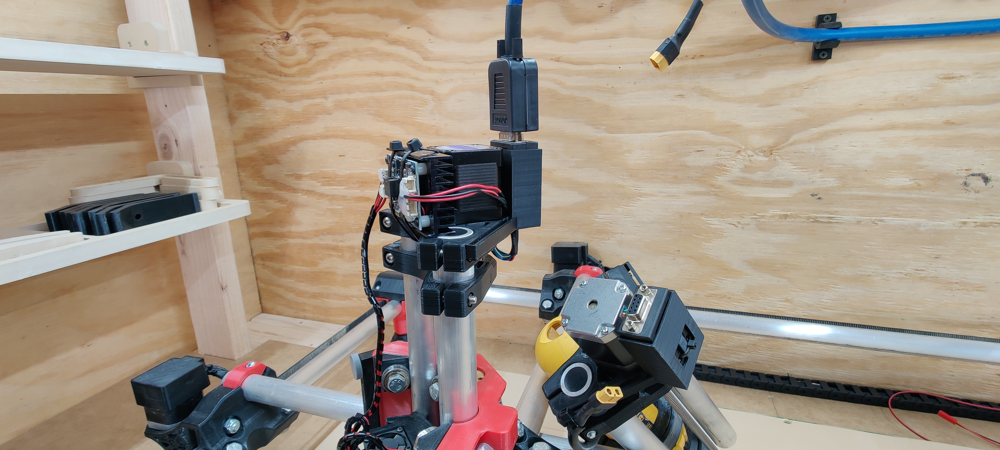

# MPCNC Hotswap Z axis

## Description
**WARNING: KILL POWER TO MPCNC WHEN CONNECTING OR DISCONNECTING ANY WIRES FROM THE MACHINE**

Since adding a laser Z-axis to my MPCNC toolkit, I was looking for a quick way to swap between my CNC and laser Z-axis. I originally had all of the wires with separate connectors to make it hot-swappable and I ended up breaking a few wires at the connector due to the movement of the Z-axis.

After a few trial and error attempts, I ended up designing a new motor mount for the Z-axis to hold a DB9 connector with all the supporting wires for swapping Z-axis assemblies with ease.

Most of the weight of the cable is being held up via retractable badge ID holders which doesn’t add unnecessary strain to the Z-axis core.

[This modification pairs very well with my MPCNC Tornado dust collection/air assist setup!](https://austinoneil.com/mpcnc-tornado/)

## Files
* motor_mount_db9.stl - Motor mount with DB9 connector  
* motor_mount_cable_management.stl - Updated motor mount with zip tie rails for connectors if you don't want to use a DB9Plug  

## Parts
* [x1 Retractable ID Badge Holder](https://www.amazon.com/gp/product/B01N5DW69F/ref=ppx_yo_dt_b_asin_title_o00_s00?ie=UTF8&psc=1)
* [20ft 18 AWG Multi 9 Conductor Blue Speed Wire 18 Gauge Copper Stranded Cable](https://www.amazon.com/gp/product/B083ZKGN5L/ref%3Dppx_yo_dt_b_asin_image_o00_s00?ie=UTF8&psc=1) 
* [1 inch (Diameter) 3:1 Waterproof Heat Shrink Tubing Kit](https://www.amazon.com/gp/product/B07VQ6X5KT/ref%3Dppx_yo_dt_b_asin_title_o01_s01?ie=UTF8&psc=1)
* [x2 Female DB9 RS232 D-Sub Serial Connectors](https://www.amazon.com/gp/product/B076F6X8WJ/ref%3Dppx_yo_dt_b_asin_title_o01_s00?ie=UTF8&psc=1)
* [x1 Male DB9 RS232 D-Sub Serial Connector](https://www.amazon.com/gp/product/B071DS5GTW/ref%3Dppx_yo_dt_b_asin_title_o01_s01?ie=UTF8&psc=1)

# Cable Pinout
Note: These are the correct wire colors for my Z motor and laser assembly. Your mileage may vary. Double-check all wiring before applying power!

| # | Umbilical Cable: | Laser Head:          | CNC Head:  |
|---|-----------------|----------------------|------------|
| 1 | Z-Motor: Black  | Z-Motor: Black      | Z-Motor: Blue  |
| 2 | Z-Motor: Green  | Z-Motor: Green      | Z-Motor: Yellow |
| 3 | Z-Motor: Blue   | Z-Motor: Blue       | Z-Motor: Green |
| 4 | Z-Motor: Red    | Z-Motor: Red        | Z-Motor: Red   |
| 5 | Laser: 5V Signal Pin (Purple)  | Laser: 5V Signal Pin  | Empty  |
| 6 | Laser: Ground (Yellow)  | Laser: Ground  | Empty  |
| 7 | Laser: 12v+ (White)  | Laser: 12v+  | Empty  |
| 8 | Buck Converter –  | Empty  | Empty  |
| 9 | Buck Converter +  | Empty  | Empty  |
